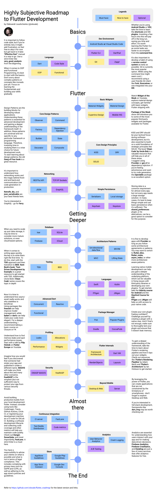

# Flutter

### DESCRIPTION

**Flutter** est un [kit de développement logiciel](https://fr.wikipedia.org/wiki/Kit_de_d%C3%A9veloppement "Kit de développement") (SDK) d'interface utilisateur open-source créé par Google. Il est utilisé pour développer des applications pour [Android](https://fr.wikipedia.org/wiki/Android "Android"), [iOS](https://fr.wikipedia.org/wiki/IOS "IOS"), [Linux](https://fr.wikipedia.org/wiki/Linux "Linux"), [Mac](https://fr.wikipedia.org/wiki/MacOS "MacOS"), [Windows](https://fr.wikipedia.org/wiki/Microsoft_Windows "Microsoft Windows"), [Google Fuchsia](https://fr.wikipedia.org/wiki/Google_Fuchsia "Google Fuchsia") et le [web](https://fr.wikipedia.org/wiki/World_Wide_Web "World Wide Web") à partir d'une seule base de code.

La première version de Flutter était connue sous le nom de code "Sky" et fonctionnait sur le [système d'exploitation](https://fr.wikipedia.org/wiki/Syst%C3%A8me_d%27exploitation "Système d'exploitation") [Android](https://fr.wikipedia.org/wiki/Android "Android"). Elle a été dévoilée lors du sommet des développeurs Dart de 2015[4](https://fr.wikipedia.org/wiki/Flutter_(logiciel)#cite_note-4), avec l'intention déclarée de pouvoir effectuer un rendu cohérent à 120 images par seconde[5](https://fr.wikipedia.org/wiki/Flutter_(logiciel)#cite_note-5) . Lors du discours d'ouverture des Google Developer Days à Shanghai, Google a annoncé la sortie de Flutter Release Preview 2 qui est la dernière grande version avant Flutter 1.0. Le 4 décembre 2018, Flutter 1.0 a été publié lors de l'événement Flutter Live, ce qui représente la première version "stable" du Framework. Le 11 décembre 2019, Flutter 1.12 a été publié lors de l'événement Flutter Interactive.

### ROADMAP



### REQUIREMENTS

To install and run Flutter, your development environment must meet these minimum requirements: **Operating Systems: Windows 10 or later (64-bit), x86-64 based**.
 Disk Space: 1.64 GB (does not include disk space for IDE/tools). Tools:
 Flutter depends on these tools being available in your environment.

### INSTALLATION

[Install | Flutter](https://docs.flutter.dev/get-started/install)

### TABLE OF CONTENT

### I- [LEARNING]()

### RESSOURCES

    **YOUTUBE**

- https://www.youtube.com/@TheFlutterWay
- [Flutter - YouTube](https://www.youtube.com/@flutterdev)
- [Abdul Aziz Ahwan - YouTube](https://www.youtube.com/@abdulazizahwan)
- https://www.youtube.com/@avcodes (UI Design)
- https://www.youtube.com/@createdbykoko/videos (UI Design)
- https://www.youtube.com/@CodexCommunity
- https://www.youtube.com/@JeronDev
- [Rabee Omran - YouTube](https://www.youtube.com/@RabeeOmran) (bloc inspiration to Learn other )
- [doctor code - YouTube](https://www.youtube.com/@DoctorCode9/) flutter ui
- https://www.youtube.com/@codeacad projects??
- [Bilgun - YouTube](https://www.youtube.com/@Bilgune) (flutter project , news application,movie application ,ecommmerce)
- [Mitch Koko - YouTube](https://www.youtube.com/@createdbykoko/videos) ( courses )
- [Akshit Madan - YouTube](https://www.youtube.com/@AkshitMadan) (TOP)
- https://www.youtube.com/@flutteruidev (TOP,news)
- https://www.youtube.com/@CodingwithT (UI , Firebase)
- https://www.youtube.com/@CodeCompilee (UI,GETX)  
- https://www.youtube.com/@RivaanRanawat 
- [Coder Sangam - YouTube](https://www.youtube.com/@codersangam) bloc

    **WEBSITES**

- https://docs.flutter.dev/
- https://flutterbyexample.com/ (Learning tutorials)
- https://fluttergems.dev/ (news,veille,packages)
- https://www.flutterbeads.com/

### CLEAN ARCHITECTURE

It is software design philosophy that separates the software system into layers of responsibility  such that the architecture remains maintanable  ,testable and extensible.

[Flutter TDD Clean Architecture Course [1] – Explanation &amp; Project Structure - YouTube](https://www.youtube.com/watch?v=KjE2IDphA_U&list=PLB6lc7nQ1n4iYGE_khpXRdJkJEp9WOech&index=1) 

### PRESENTATION LAYER

It present app content,it handles the user interactions

- page: application pages

- State management: file remain to state management that we use

- Widgets

### DOMAIN LAYER

only dart without flutter, business logic of the application, not affected by changes in outer layers

- **Entities** : create based on data

- **Repositories interfaces(abstract classes,contracts)**
  
  - **Use cases(Sign up,Login)** : class that encapsulate all business logic of a particular use cases of the app, it refers to a specific action or functionality that  a user can perform within an application. It represents a logical unit of work that an application can perform in response   to user's request or an event

### DATA LAYER

Responsable for data retrevial,Api call a server or local database

- **repositories** : call data from differents data sources

- **data sources** : Local or remote datasource.

- **models** 


- assets (icons,images,fonts)


## PACKAGES

- **SharedPreferences**

SharedPreferences. shared_preferences is a Flutter plugin that **allows you to save data in a key-value format so you can easily retrieve it later**. Behind the scenes, it uses the aptly named SharedPreferences on Android and the similar UserDefaults on iOS.

```dart
saveData() async{
    var shared = await SharedPreferences.getInstance();
    shared.setBool("human",true);
}

receiveData() async{
    var shared = await SharedPreferences.getInstance();
    shared.getBool("human",true);
}

shared.remove("human");
```
