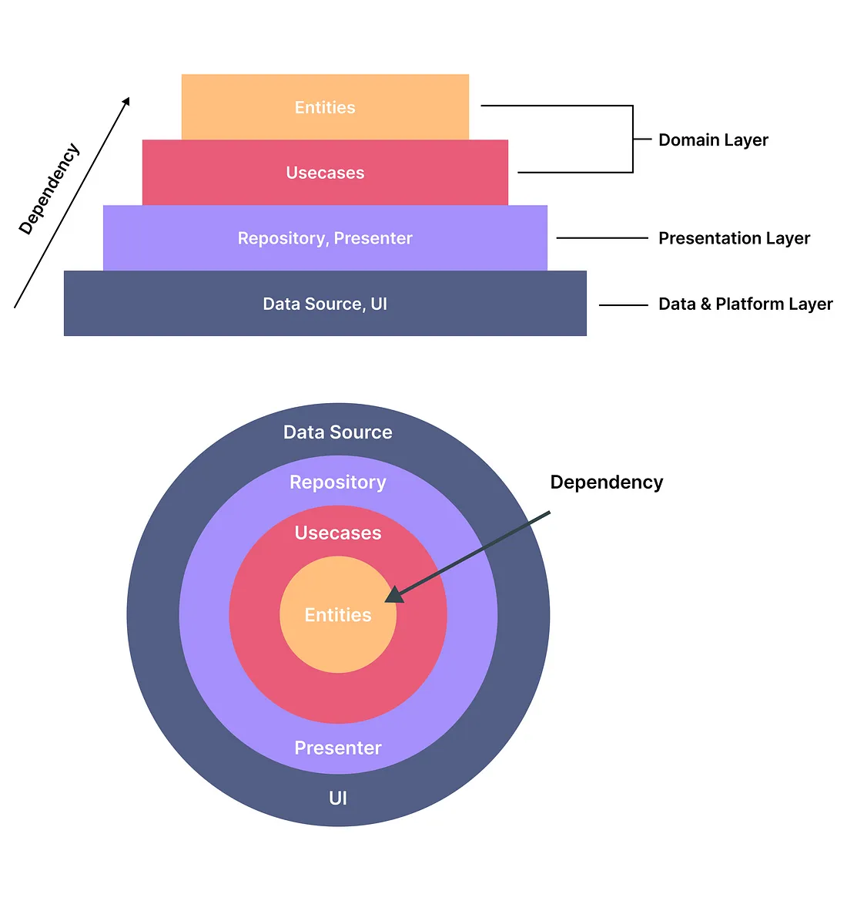
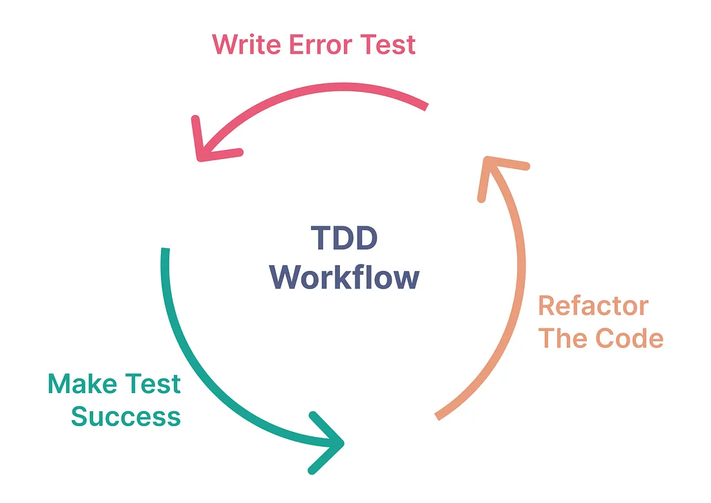

# Clean Architecture

Architecture
 is very important in developing an application. Architecture can be 
likened to a floor plan that describes how the flow in an application 
project. The main purpose of implementing the architecture is the 
separation of concern (SoC). So, it will be easier if we can work by 
focusing on one thing at a time.

In
 the context of Flutter, clean architecture will help us to separate 
code for business logic with code related to platforms such as UI, state
 management, and external data sources. In addition, the code that we 
write can be easier to test (testable) independently.

Clean Architecture Diagram

As
 in the diagram above, the clean architecture is depicted as a pyramid 
or a slice of onion when viewed from the top. The clean architecture 
will divide the Flutter project into 3 main layers, namely:

## Data & Platform layer

The
 data layer is located at the outermost layer. This layer consists of 
data source code such as consume Rest API, access to the local database,
 Firebase, or other sources. Also, on this layer, there is usually the 
platform code that builds up the UI (widgets).

## Presentation Layer

The
 presentation layer consists of the code to access the data of the app 
from a repository. Also, there is the code for state management such as 
providers, BLoC, and so on.

## Domain Layer

The
 domain layer is the deepest in the clean architecture. This layer 
contains the code for business logic applications such as entities and 
use cases.

> Each
>  layer depends on the other layers. The arrows on the diagram show how 
> the layers are related. The outermost layer will depend on the inner 
> layer and so on.

The
 layer that does not depend on any other layers here is only the domain 
layer (independent) which is the code for the business logic. That way, 
the application is more adaptable and dynamic. For example, if we want 
to change the state management from the provider to BLoC, the migration 
process will not interfere with the existing business logic.

# Test-Driven Development

In
 addition to implementing the clean architecture, to optimize the 
development process in terms of producing minimal bugs and reducing 
repetitive debugging and fixing processes, we must undergo a testing 
process.

Test-Driven
 Development is an application development process where testing is the 
main character that drives the development. Testing code scenarios will 
be written first before creating a feature in the application.

Test-Driven Development Workflow

The
 workflow of the application development process with TDD is as shown in
 the diagram above. Note that the TDD process is iterative and it’s 
called the Red-Green-Refactor process.

## Step — 1: Write testing scenarios (Red)

The development of a feature begins with writing a test scenario first. writing test scenarios usually follows the feature requirements in a PRD document (for the case in a company). In the test scenario, there will usually be a flow of the developed features such as determining the data source used (eg remote or local), ensuring the incoming data from the API produces the appropriate model, designing the state flow of the view
 based on the data, and so on. . The first time we write a test scenario, we will get errors. This is normal because the feature code does not yet exist.

> Writing a test scenario for a feature is done as a guide in developing the feature (actual code).

## Step — 2: Make the testing scenarios successful (Green)

In this step, the actual feature code writing is done. Writing code at this stage does not have to be neat and optimal because the main goal in this step is to make the testing code that has been made previously successful.

## Step — 3: Refactor the code

After the testing code has been successfully run without any errors, it is time to tidy up and optimize the code that has been written, both testing code and actual feature code.

The TDD process, the final result that will be obtained is in addition to an application that has minimal bugs, as well as a neat and optimal application code.

## Step — 1: Writing code on the domain layer

The first step is to write code at the domain layer. Why the domain layer?  because this layer is a layer that does not depend on any other layer. So it will be safer if you start from this layer.

## Usecases

In the test/domain section, we only need to write test scenarios for use cases. In this case, we have 1 use case, `get_current_weather_test.dart`.

> The test code above will have an error at the beginning. This is normal because we haven’t written the actual code yet.

For actual feature code at the domain layer, there are 3 parts, namely entities, use cases, and repositories. We start by writing the weather entity which is the `weather.dart`

After that, we continue by writing code for `weather_repository.dart`. The weather repository is an abstract class and will be implemented later at the data layer.

Then, we will write code for the use case `get_current_weather.dart`.

Before going back to testing code, we have to create a mock weather repository. Open `test_helper.dart` and add `WeatherRepository`. In `test _helper.dart` there is also a mock for the HTTP library so that it can simulate requests to the API during testing.

Run the following command via the terminal to generate the mock file:

flutter pub run build_runner build

After that, go back to the `get_current_weather_test.dart` and import the `MockWeatherRepository` then runs the test.

Get current weather use case test result

## Step — 2: Writing code on the data layer

After
 working on the testing code and features at the domain layer, we can 
now move on to working on the code at the data layer. At the data layer,
 there are data sources, models, and repositories.

> Wait
>  a minute, is there a repository at the domain layer too? Yes, the 
> repository at the domain layer is in the form of an abstract class in 
> which there are functions that still need to be implemented. So, it is 
> in the repository at the data layer that we will start implementing the 
> abstract class.

## Models

Ok, we will start with models, the process begins by writing testing code for the model, `weather_model_test.dart`. Here, we will test 3 main things:

- Is the model that we have created equal with the entities at the domain layer?
- Does the `fromJson()` function return a valid model?
- Does the `toJson()` function returns the appropriate JSON map?

Then, we continue by writing the code for `weather_model.dart`

After that, go back to the testing code and import `weather_model.dart` then runs the test.

Model testing result

## Data Sources

We continue with working on the code in the data sources. Here is the code for `remote_data_source_test.dart`.

The above `remote_data_source_test.dart` code will test the process of getting weather data from the API. There are two conditions:

- Returning a valid model when getting data is successful
- Returning a `ServerException` when getting data is failed

We also need dummy data in `JSON` form like this:

Sample JSON response

Then continue by writing the code for the data source, `remote_data_source.dart`.

After that, go back to the testing code and import `remote_data_source.dart` then runs the test.

Data sources testing result

## Repositories

Next, we will work on the code for the repository, namely `weather_repository_impl_test.dart` and `weather_repository_impl.dart`. The term `impl` here means implementation.

For testing on `weather_repository_impl_test.dart` we need to access the data source. So, we will first generate a mock for the remote data source that we created earlier. Add `RemoteDataSource` to `test_helper.dart` as follows:

Then, run the following **command** to generate a mock from the data source:

flutter pub run build_runner build

Now, the `MockRemoteDataSource` is ready to use for testing, now we work on the code for `weather_repository_impl_test.dart`.

In the code above the scenarios tested are:

- Returns `current weather` data on successful API request
- Returns `ServerFailure` when the request to API fails
- Restore `ConnectionFailure` when not connected to the internet

Now let’s continue with working on `weather_repository_impl.dart`.

After that, go back to the testing code and import `weather_repository_impl.dart` then runs the test.

Repository testing result

## Step — 3: Writing code on the presentation layer

After
 working on the domain and data layers, the final step is working on the
 code at the presentation layer. At this layer, there are state 
management (in this case we use *BLoC*), and pages.

## State management (*BLoC*)

First, we will code state management (*BLoC*). For testing on `weather_bloc_test.dart`, we need to access the use case which is `MockGetCurrentWeather`.

Then run the following command to generate a mock from GetCurrentWeather.

flutter pub run build_runner build

Then, we continue by working on the *BLoC* state management code. Here our *BLoC* code consists of `weather_state.dart`, `weather_event.dart`, and `weather_bloc.dart`.

After that, go back to the testing code and import `weather_bloc.dart` then runs the test.

BLoC state management testing result

## Pages

After working on the *BLoC* code, then we will create code for the pages or UI of the application. Let’s start with the testing code, namely `weather_page_test.dart`. Here, we will test 3 things:

- The state of the app should change from `WeatherEmpty` to `WeatherLoading` when it’s finished fill the `TextField`.
- Displays a progress indicator when the state of the application is `WeatherLoading`.
- Displays a widget containing weather information when the state of the application is `WeatherHasData`.

Then, we continue by writing the code for `weather_page.dart`.

After that, go back to the testing code and import `weather_page.dart` then runs the test.
