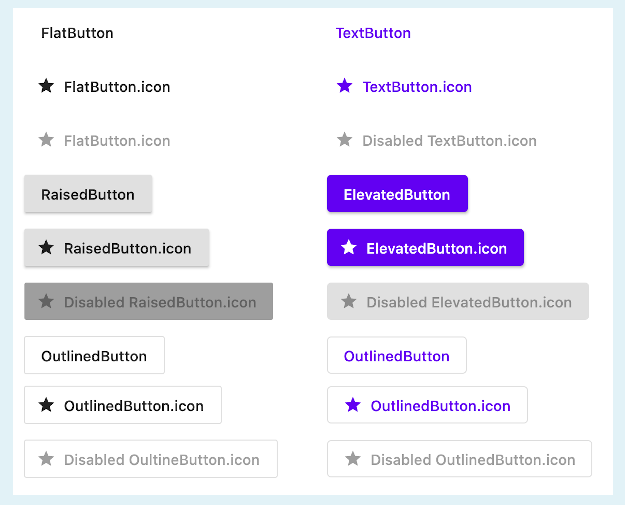

# LEARNING

- **every layout without have child widget**

- **Everything in flutter is almost widget**

### ADD DEPENDENCY

```dart
pub add dependency
flutter clean
flutter pub get
```

### WIDGETS

- **MaterialApp** : represent whole application

```dart
-   debugShowCheckedModeBanner: false,//enlever le debug en haut
```

- **AppBar**

- **Scaffold**

- **TextSpan**

- **Text**

### TWO TYPES OF WIDGETS

- **DISPLAY WIDGET** (Text,TextSpan,Text.rich,Image/Icon,Button,Chip,Badges,Alert,SnakeBar)

- **LAYOUT WIDGET** (Center,Container,Row,Column,Table,Stack,Positioned,Padding/Margin,ListView,Expanded,Positioned)

### STATELESS WIDGET

A stateless widget never changes. Icon , IconButton , and Text are examples of stateless widgets

Le StatelessWidget est une classe (un widget) qui sert à créer une interface utilisateur. Comme son nom l’indique, elle n’a pas vocation à voir son état évoluer dans le temps.

### ORGNIZE APPLICATION

- **STATELESSMaterialApp > Scaffold > Widgets**

- **Create Folder : Screens to add Screen in** 

### STATELESS WIDGETS

- **Image** :pubspec.yaml, uncomment assets and add images

```dart
-Asset: const Image(image: AssetImage("images/image.png"),height: 100,width: 100,));
  }
-Network: Image(image:NetWorkImage("url"));
```

- **ICONS** : Material Icons(Default), FontAwesome Icons(dependency required)    

```dart
pub add font_awesome_flutter
- IconButton(
            iconSize: 80,
            color: Colors.yellow,
            icon:
                const Icon(Icons.phone_outlined),
            onPressed: () {
              print("hello");
            }, 
          ),


- FontAwesomeIcons.user
```

- **CONTAINER:** contains multiple widgets ,use padding,margin ,shadow on it
  - don't use color and boxDecoration same time

```dart
Container(
          width: 350.0,
          height: 250.0,
          margin: const EdgeInsets.all(50.0),
          padding: const EdgeInsets.all(20.0),
          alignment: Alignment.center,
          decoration: BoxDecoration(
              border: Border.all(color: Colors.lightBlue, width: 6.0),
              color: Colors.blue,
              // borderRadius: const BorderRadius.all(Radius.circular(10.0),),
              shape: BoxShape.circle,
              image:
                  const DecorationImage(image: AssetImage("images/image.png")),
              boxShadow: [
                BoxShadow(
                    color: Colors.grey.shade900,
                    blurRadius: 7,
                    spreadRadius: 5,
                    offset: const Offset(4, 4))
              ]),
          // child: const Text(
          //   "TESTING",
          //   style: TextStyle(fontSize: 40, fontWeight: FontWeight.bold),
          // ),
        )
```

- **ELEVATED BUTTON** :
  
  - **use this backgroundColor: Colors.yellow,** instead of **primary (Deprecated)**
  
  - **foregroundColor: Colors.black,** instead of **onPrimary**

```dart
//simple
ElevatedButton(
          onPressed: () {},
          style: ElevatedButton.styleFrom(
              fixedSize: const Size(200, 100),
              backgroundColor: Colors.yellow,
              foregroundColor: Colors.black,
              textStyle:
                  const TextStyle(fontSize: 25, fontWeight: FontWeight.bold),
              //NOTE: shadow
              elevation: 15,
              shadowColor: Colors.blue,
              // NOTE:border
              side: const BorderSide(color: Colors.red, width: 10),
              alignment: Alignment.center,
              shape: const OvalBorder()),
          child: const Icon(Icons.ac_unit),
        ),


//icon
ElevatedButton.icon(
          onPressed: () {},
          style: ElevatedButton.styleFrom(
              padding:const EdgeInsets.all(20),
              fixedSize: const Size(300, 70),
              backgroundColor: Colors.yellow,
              foregroundColor: Colors.black,
              textStyle:
                  const TextStyle(fontSize: 25, fontWeight: FontWeight.bold),
              //NOTE: shadow
              elevation: 15,
              shadowColor: Colors.blue,
              // NOTE:border
              side: const BorderSide(color: Colors.red, width: 10),
              alignment: Alignment.center,
              shape: const StadiumBorder()),
          icon: const Icon(Icons.ac_unit),
          label: const Text("Man with a mission"),
        ),
```

- **Other Buttons: TextButton,OutlineButton**



- **AppBAR**

```dart
AppBar(
          leading: const Icon(Icons.menu_book),
          title: const Text("Menu Book"),
          backgroundColor: Colors.purple,
          flexibleSpace:  const Image(image:  NetworkImage("https://miro.medium.com/v2/resize:fit:1400/format:webp/0*vQwPKDYJVQr0dEKm.jpeg"),fit: BoxFit.cover,),
          actions: [
            IconButton(
                onPressed: () {},
                icon: const Icon(
                  Icons.abc,
                  size: 35,
                )),
            IconButton(
                onPressed: () {},
                icon: const Icon(
                  Icons.search,
                  size: 35,
                )),
            IconButton(
                onPressed: () {},
                icon: const Icon(
                  Icons.leaderboard,
                  size: 35,
                ))
          ],
        ),
```

- **ROW COLUMN** : **Expanded , pour eviter les crash du au faite qu' il n'  a pas assez d' espace pour les widgets d'un Row ou Column**,

```dart
Column(
          children: [
            Row(
              mainAxisAlignment: MainAxisAlignment.spaceEvenly,
              children: const [
                Expanded(
                  child: Image(
                    image: AssetImage("images/image.png"),
                    width: 200,
                    height: 200,
                  ),
                ),
                // NOTE:WITH FLEX IL VA AVOIR PLUS D' ESPACE
                Expanded(
                  flex: 3,
                  child: Image(
                    image: AssetImage("images/image.png"),
                    width: 200,
                    height: 200,
                  ),
                ),
                Expanded(
                  child: Image(
                    image: AssetImage("images/image.png"),
                    width: 200,
                    height: 200,
                  ),
                )
              ],
            ),
            Row(
              mainAxisAlignment: MainAxisAlignment.center,
              children: const [
                Icon(Icons.star),
                Icon(Icons.star),
                Icon(Icons.star),
                Icon(Icons.star_half),
                Icon(Icons.star_border)
              ],
            ),
            Row(
              mainAxisAlignment: MainAxisAlignment.spaceEvenly,
              children: const [
                Icon(
                  Icons.phone,
                  size: 50,
                ),
                Icon(
                  Icons.share,
                  size: 50,
                )
              ],
            )
          ],
        )
```

- **LISTVIEW** - **STATIC LIST** :ListView is the default constructor of the [ListView](https://api.flutter.dev/flutter/widgets/ListView-class.html) class. A ListView simply takes a list of children and makes it scrollable.
  
  Usually, this should be used with a **small number of children,** as the List will also construct the invisible elements in the list and a large number of elements may render this inefficient.

```dartag-0-1grj00gf2ag-1-1grj00gf2
//type1
ListView(
          //itemExtent:space between tile
          scrollDirection: Axis.vertical,
          itemExtent: 50.0,
          children: [
            ListTile(
              leading: const Icon(Icons.apple,color: Colors.blue),
              title: const Text("Sales"),
              subtitle: const Text("Sales of the week"),
              trailing: const Text("2540"),
              onTap: () {},
            ),
            ListTile(
              leading: const Icon(Icons.egg),
              title: const Text("Sales"),
              subtitle: const Text("Sales of the week"),
              trailing: const Text("2390"),
              onTap: () {},
            ),
            ListTile(
              leading: const Icon(Icons.wallet),
              title: const Text("Sales"),
              subtitle: const Text("Sales of the week"),
              trailing: const Text("2340"),
              onTap: () {},
            )
          ],
        ),
//type 2
ListView(
          children: const [
            Padding(
              padding: EdgeInsets.all(20.0),
              child: Icon(Icons.add),
            ),
            Divider(color: Colors.red),
            Padding(
              padding: EdgeInsets.all(30),
              child:  Text(
                  "Nisi ullamco non amet excepteur nostrud non do in consectetur ut duis ut anim. Do cupidatat id minim eiusmod laboris veniam fugiat. Cillum ipsum aliquip mollit ex eiusmod aute eiusmod in eiusmod irure irure esse labore.Id irure irure nisi mollit ipsum anim ea pariatur velit. Pariatur deserunt laborum commodo aliqua enim nulla enim. Irure ad deserunt aute magna velit voluptate. Voluptate est velit duis ad fugiat labore laboris in exercitation aliqua ex consectetur deserunt. Sit id cillum dolor nulla voluptate pariatur pariatur ullamco laboris. Nisi consectetur excepteur duis tempor veniam eu pariatur in.Est est anim enim commodo amet reprehenderit amet voluptate ea tempor fugiat velit labore. Fugiat ullamco ex incididunt voluptate pariatur sunt esse velit dolor est. Irure nostrud aute magna incididunt ut nostrud cillum in aliqua exercitation. Reprehenderit occaecat sunt irure et nulla cillum id tempor occaecat velit et. Excepteur occaecat eu ipsum culpa est ipsum consequat minim tempor.Ipsum exercitation officia aute velit incididunt cupidatat quis et cupidatat cupidatat mollit tempor. Lorem cillum ullamco est eiusmod in ipsum ut deserunt occaecat sunt quis aute nostrud et. Ullamco cupidatat sunt voluptate laboris veniam id Lorem aliquip fugiat. Culpa est laboris ullamco velit amet deserunt eu pariatur voluptate minim. Irure ut Lorem ex enim anim Lorem consequat duis magna ut. Esse laboris ea ipsum aute do reprehenderit voluptate occaecat reprehenderit aute ex ad ipsum. Culpa sit irure labore amet consequat aliquip proident commodo excepteur laborum id do incididunt do. Incididunt aute esse qui culpa est Lorem laboris. Exercitation aliquip commodo consequat incididunt nulla minim ipsum minim tempor eiusmod laborum voluptate. Laborum cupidatat incididunt irure ad dolore tempor. Tempor ex do voluptate aliquip id.Sit mollit deserunt laborum nisi non. Sunt quis ea incididunt occaecat quis. Ullamco anim et ullamco magna eiusmod consequat esse mollit aute occaecat voluptate. Veniam sit qui labore reprehenderit commodo dolore quis eu. Duis culpa aute tempor reprehenderit exercitation. Nisi deserunt mollit consectetur occaecat sunt qui ipsum veniam ex elit quis laborum voluptate. Laborum consectetur est nostrud commodo ex. Aute ex cupidatat ad anim dolor irure nostrud duis enim amet nostrud occaecat sint deserunt. Voluptate ea do nulla veniam aliqua Lorem sit velit excepteur. Do officia do consequat velit aliqua reprehenderit exercitation sint pariatur cillum cupidatat consectetur eu. Adipisicing id elit quis excepteur mollit eu id elit ullamco. Eu mollit exercitation aliquip laboris ad aliqua ipsum ea. Aliqua eiusmod deserunt Lorem in do ad nulla. Nulla veniam exercitation reprehenderit dolore ex dolor proident officia culpa cillum anim excepteur aute excepteur. Sint ex do Lorem eiusmod ut proident. Esse aliquip nulla quis qui exercitation consequat consectetur dolor culpa reprehenderit voluptate excepteur cupidatat duis. Sunt ut ipsum velit id. Incididunt excepteur laboris ut culpa veniam exercitation proident et laborum occaecat pariatur ea cupidatat cupidatat. Voluptate aute eiusmod id ex dolor proident elit anim non est nulla voluptate. Consectetur cupidatat duis eu magna consequat dolore et nulla aliqua dolore tempor ipsum consequat in. Eiusmod proident reprehenderit nostrud laboris duis et irure reprehenderit. Culpa id labore consequat ea laboris id in commodo labore. Nostrud non ipsum ullamco occaecat duis Lorem. Occaecat pariatur culpa duis fugiat aliquip.Aliquip est Lorem mollit ut irure magna laborum reprehenderit ipsum elit nulla culpa exercitation. Qui sint ut anim do sit exercitation velit nostrud cillum sint consectetur. Qui laborum enim sit irure pariatur minim veniam. Duis ut et culpa ex irure anim exercitation occaecat laborum voluptate elit. Labore ad qui sunt veniam quis incididunt esse cupidatat fugiat nostrud ea officia laborum dolor. Reprehenderit exercitation proident dolor aliquip nisi exercitation amet aute magna et."),
            )
          ],
        ),
```

- **LISTVIEW.BUILDER** : To work with lists that contain a large number of items, it’s best to use [**ListView**. **builder**](https://api.flutter.dev/flutter/widgets/ListView/ListView.builder.html) constructor. In contrast to the default **ListView** constructor, which requires creating all items at once, the **ListView**. **builder**() constructor creates items as they’re scrolled onto the screen or only when items need to be displayed on the screen. It works as an **Android** RecyclerView but is a lot easier to set up.
  
  **ListView**. **builder** is a way of constructing the list where children’s (Widgets) are built on demand. However, instead of returning a static widget, it calls a function that can be called multiple times (based on itemCount ) and it’s possible to return a different widget at each call.

```dart
class ListVB extends StatelessWidget {
   ListVB({super.key});
  List<String> products = ['hello', 'what ', 'up'];
  List<int> price = [200, 300, 400, 400, 500];
  @override
  Widget build(BuildContext context) {
    return Scaffold(
        appBar: AppBar(title: const Text("Man with a mission",style: TextStyle(fontSize: 30),)),
        body: Container(
          child: ListView.builder(
              itemCount: products.length,
              itemBuilder: (context, index) {
                return Text(products[index],style: const TextStyle(fontSize: 30),);
              }),
        ));
  }
}
```

- **OTHERS** : 

```dart
Padding(
     padding: EdgeInsets.all(20.0),
     child: Icon(Icons.add),
),
Divider(color: Colors.red),
```

- **NAVIGATION DRAWER**

```dart
 Scaffold(
      appBar: AppBar(title: const Text("Navigation Drawer")),
      drawer: Drawer(
        elevation: 0,
        child: ListView(
          children: [
            const UserAccountsDrawerHeader(
              accountName: Text("KPIDIBA"),
              accountEmail: Text("kpidibadavid1@gmail.com"),
              currentAccountPicture: CircleAvatar(
                foregroundImage: AssetImage("images/image.png"),
              ),
              otherAccountsPictures: [
                CircleAvatar(
                  foregroundImage: AssetImage("images/image.png"),
                ),
                CircleAvatar(
                  foregroundImage: AssetImage("images/image.png"),
                ),
                CircleAvatar(
                  foregroundImage: AssetImage("images/image.png"),
                )
              ],
            ),
            ListTile(
              leading: const Icon(Icons.home),
              title: const Text("Home"),
              onTap: () {},
            ),
            ListTile(
              leading: const Icon(Icons.shopping_cart),
              title: const Text("Home"),
              onTap: () {},
            ),
            ListTile(
              leading: const Icon(Icons.favorite),
              title: const Text("Home"),
              onTap: () {},
            ),
            const Padding(
              padding: EdgeInsets.all(14.0),
              child: Text("LABELS"),
            ),
            ListTile(
              leading: const Icon(Icons.label),
              title: const Text("Red"),
              onTap: () {},
            ),
            ListTile(
              leading: const Icon(Icons.label),
              title: const Text("Blue"),
              onTap: () {},
            ),
            ListTile(
              leading: const Icon(Icons.label),
              title: const Text("Green"),
              onTap: () {},
            ),
          ],
        ),
      ),
    );
```

- **FLOATING ACTION BUTTON AND BOTTOMNAVIGATION BAR**  

```dart
Scaffold(
      appBar: AppBar(title: const Text("Navigation Drawer")),
      floatingActionButtonLocation: FloatingActionButtonLocation.centerDocked,
      floatingActionButton: FloatingActionButton(
        onPressed: () {},
        backgroundColor: Colors.black45,
        foregroundColor: Colors.yellow,
        elevation: 0,
        // shape: BeveledRectangleBorder(
        //     borderRadius: BorderRadius.circular(20),
        //     side: const BorderSide(
        //         color: Colors.blue, width: 2.0, style: BorderStyle.solid)),
        mini: true,
        child: const Icon(Icons.add),
      ),
      bottomNavigationBar: BottomAppBar(
        notchMargin: 5.0,
        shape: const CircularNotchedRectangle(),
        color: Colors.lightBlue,
        child: Row(
            mainAxisAlignment: MainAxisAlignment.spaceAround,
            mainAxisSize: MainAxisSize.max,
            children: [
              Padding(
                padding: const EdgeInsets.only(left: 10.0),
                child: Column(
                  mainAxisSize: MainAxisSize.min,
                  children: const [
                    Icon(
                      Icons.ac_unit,
                      color: Colors.white,
                    ),
                    Text("HOME")
                  ],
                ),
              ),
              Padding(
                padding:
                    const EdgeInsets.only(top: 10.0, bottom: 10.0, right: 20.0),
                child: Column(
                  mainAxisSize: MainAxisSize.min,
                  children: const [
                    Icon(
                      Icons.home,
                      color: Colors.white,
                    ),
                    Text("HOME")
                  ],
                ),
              ),
              Padding(
                padding: const EdgeInsets.only(left: 10.0),
                child: Column(
                  mainAxisSize: MainAxisSize.min,
                  children: const [
                    Icon(
                      Icons.man_2,
                      color: Colors.white,
                    ),
                    Text("HOME")
                  ],
                ),
              ),
              Padding(
                padding: const EdgeInsets.only(left: 10.0),
                child: Column(
                  mainAxisSize: MainAxisSize.min,
                  children: const [
                    Icon(
                      Icons.man_2,
                      color: Colors.white,
                    ),
                    Text("HOME")
                  ],
                ),
              )
            ]),
      ),
    );
```

- **STACK** 

```dart
Stack(
          alignment: Alignment.center,
          children: [
            Container(
              width: 300,
              height: 200,
              color: Colors.green,
            ),
            Positioned(
              bottom: 0,
              child: Container(
                width: 200,
                height: 100,
                color: Colors.blue,
              ),
            ),
            Container(
              width: 100,
              height: 50,
              color: Colors.red,
            )
          ],
        ),
```

- **CUSTOM WIDGET**

- **STATEFUL VS STATELESS**


### STATEFULL WIDGET

- **Flutter Navigation**

- **TextField**
  
  - TextFormField recommended
  
  - TextField not recommended
  
  - Way controller or id to hook (recommended to get data)
  
  - onChanged() event not recommended
  
  - version 1
  
  ```dart
   //declare attribute and method
    var _data = "";
    void _updateData(val) {
      setState(() {
        _data = val;
      });
    }
  ------------------------------------------ 
  
   TextFormField(
            onChanged: (data) {
              _updateData(data);
            },
            decoration: const InputDecoration(
                labelText: "Product name",
                prefixIcon: Icon(Icons.verified_user),
                // icon: Icon(Icons.verified_user),
                border: OutlineInputBorder()),
          ),
          Text(
            "value equals $_data",
            style: const TextStyle(fontSize: 20),
          )
  ```
  
  ```dart
  class FormD extends StatefulWidget {
    const FormD({super.key});
  
    @override
    State<FormD> createState() => _FormDState();
  }
  
  class _FormDState extends State<FormD> {
    var _data;
    final _dataController = TextEditingController();
  
    @override
    void initState() {
      super.initState();
      _dataController.addListener(_updateData);
    }
  
    void _updateData() {
      setState(() {
        _data = _dataController.text;
      });
    }
  
    @override
    Widget build(BuildContext context) {
      return Scaffold(
        appBar: AppBar(
          title: const Text("Formulaire"),
          centerTitle: true,
        ),
        body: Center(
            child: Container(
          padding: const EdgeInsets.all(20.0),
          child: ListView(children: [
            const TextField(
              decoration: InputDecoration(
                  hintText: "Product name", icon: Icon(Icons.verified_user)),
            ),
            const Padding(
              padding: EdgeInsets.all(10),
            ),
            TextFormField(
              controller: _dataController,
              decoration: const InputDecoration(
                  labelText: "Product name",
                  prefixIcon: Icon(Icons.verified_user),
                  // icon: Icon(Icons.verified_user),
                  border: OutlineInputBorder()),
            ),
            Text(
              "value equals ${_dataController.text}",
              style: const TextStyle(fontSize: 20),
            )
          ]),
        )),
      );
    }
  
    OutlinedButton myBtn(BuildContext context) {
      return OutlinedButton(
          onPressed: () {
            Navigator.push(context, MaterialPageRoute(builder: (context) {
              return const DetailsD();
            }));
          },
          child: Text(
            "Submit Form".toUpperCase(),
            style: const TextStyle(fontWeight: FontWeight.bold),
          ));
    }
  }
  ```

- **RadioButton**

```dart
Row(
            children: [
              Expanded(
                child: RadioListTile(
                    contentPadding: const EdgeInsets.all(0.0),
                    value: ProductTypeEnum.Deliverable,
                    groupValue: _productTypeEnum,
                    title: Text(ProductTypeEnum.Deliverable.name),
                    onChanged: (value) => setState(() {
                          _productTypeEnum = value;
                        })),
              ),
              Expanded(
                child: RadioListTile(
                    contentPadding: const EdgeInsets.all(0.0),
                    value: ProductTypeEnum.Downloadable,
                    groupValue: _productTypeEnum,
                    title: Text(ProductTypeEnum.Downloadable.name),
                    onChanged: (value) => setState(() {
                          _productTypeEnum = value;
                        })),
              ),
            ],
          ),
```

- **CheckBox**

```dart
import 'package:flutter/material.dart';
import 'package:learning/screens/parts/details.dart';

class FormD extends StatefulWidget {
  const FormD({super.key});

  @override
  State<FormD> createState() => _FormDState();
}

class _FormDState extends State<FormD> {
  var _data;
  final _dataController = TextEditingController();
  bool? _checkBox = true;

  // @override
  // void initState() {
  //   super.initState();
  //   _dataController.addListener(_updateData);
  // }

  @override
  void dispose() {
    super.dispose();
    _dataController.dispose();
  }

  void _updateData() {
    setState(() {
      _data = _dataController.text;
    });
  }

  @override
  Widget build(BuildContext context) {
    return Scaffold(
      appBar: AppBar(
        title: const Text("Formulaire"),
        centerTitle: true,
      ),
      body: Center(
          child: Container(
        padding: const EdgeInsets.all(20.0),
        child: ListView(children: [
          const TextField(
            decoration: InputDecoration(
                hintText: "Product name", icon: Icon(Icons.verified_user)),
          ),
          const Padding(
            padding: EdgeInsets.all(10),
          ),
          TextFormField(
            controller: _dataController,
            decoration: const InputDecoration(
                labelText: "Product name",
                prefixIcon: Icon(Icons.verified_user),
                // icon: Icon(Icons.verified_user),
                border: OutlineInputBorder()),
          ),
          const SizedBox(
            height: 10.0,
          ),
          Text(
            "value equals ${_dataController.text}",
            style: const TextStyle(fontSize: 20),
          ),
          const SizedBox(
            height: 10.0,
          ),
          Checkbox(
            checkColor: Colors.black,
            activeColor: Colors.white,
            value: _checkBox,
            onChanged: (value) => setState(() {
              print("value");
              _checkBox = value;
            }),
          ),
          myBtn(context)
        ]),
      )),
    );
  }

  OutlinedButton myBtn(BuildContext context) {
    return OutlinedButton(
        onPressed: () {
          Navigator.push(context, MaterialPageRoute(builder: (context) {
            return DetailsD(
              dataValue: _dataController.text,
            );
          }));
        },
        child: Text(
          "Submit Form".toUpperCase(),
          style: const TextStyle(fontWeight: FontWeight.bold),
        ));
  }
}
```

- **Dropdown**

```dart

```

- **Form**
